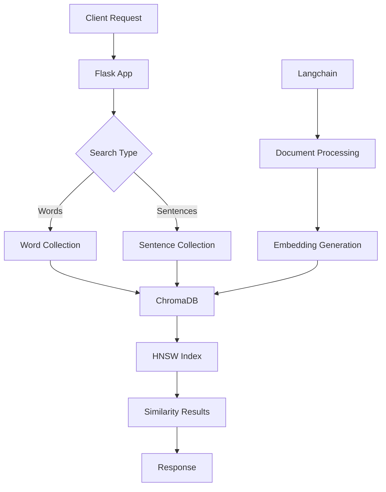

# 🚀 ChromaDB & Langchain Entegreli Semantik Arama Sistemi

Bu proje, **ChromaDB** ve **Langchain** kullanarak ölçeklenebilir ve etkili Türkçe semantik arama sistemi sağlar. Artık numpy tabanlı bellek-içi aramalar yerine profesyonel vektör veritabanı teknolojileri kullanıyoruz.

## 🔄 Önemli Değişiklikler

### ✅ Eski Sistem (Sorunlu)
- Numpy tabanlı brute-force arama
- Tüm vektörler RAM'de
- Ölçeklenemeyen yapı
- Yavaş arama performansı

### 🎯 Yeni Sistem (ChromaDB + Langchain)
- **ChromaDB** vektör veritabanı
- **Langchain** framework entegrasyonu
- HNSW indeksleme ile hızlı arama
- Ölçeklenebilir ve profesyonel yapı

## 📦 Kurulum

### 1. Bağımlılıkları Yükle
```bash
pip install -r requirements.txt
```

### 2. Virtual Environment Aktifleştir
```bash
source venv/bin/activate
```

### 3. ChromaDB Veritabanını Hazırla

#### Kelimeler için:
```bash
python vektor_veritabani.py
```

#### Cümleler için:
```bash
python cümle_veritabani.py
```

## 🎮 Uygulamalar

### 1. ChromaDB Tabanlı Flask App
```bash
python app.py
```
- Port: 5001
- ChromaDB entegreli
- Mevcut arayüz ile uyumlu

### 2. Langchain Tabanlı Gelişmiş App
```bash
python app_langchain.py
```
- Port: 5002
- Hibrit arama özelliği
- Gelişmiş API endpoints

## 🔧 API Endpoints

### Temel Arama
```http
POST /search
Content-Type: application/json

{
    "query": "kitap",
    "type": "words",    // veya "sentences"
    "top_k": 5
}
```

### Hibrit Arama (Sadece Langchain App)
```http
POST /hybrid_search
Content-Type: application/json

{
    "query": "okul",
    "top_k": 3
}
```

### Benzer Kelimeler
```http
GET /similar_words/kitap
```

### Sistem İstatistikleri
```http
GET /stats
```

### Sağlık Kontrolü
```http
GET /health
```

## 📊 Performans Karşılaştırması

| Özellik | Eski Sistem (Numpy) | Yeni Sistem (ChromaDB) |
|---------|---------------------|------------------------|
| **Arama Hızı** | O(n) - Doğrusal | O(log n) - Logaritmik |
| **Bellek Kullanımı** | Tüm vektörler RAM'de | Disk tabanlı, optimized |
| **Ölçeklenebilirlik** | ❌ Sınırlı | ✅ Milyonlarca vektör |
| **Indeksleme** | ❌ Yok | ✅ HNSW, IVF |
| **Persistence** | ❌ Dosya tabanlı | ✅ Veritabanı |

## 🏗️ Sistem Mimarisi



## 🔍 Teknoloji Stack

- **Backend**: Flask (Python)
- **Vector Database**: ChromaDB
- **ML Framework**: Langchain
- **Embeddings**: Sentence Transformers (BERT Turkish)
- **Search Algorithm**: HNSW (Hierarchical Navigable Small World)
- **API**: RESTful JSON

## 📁 Dosya Yapısı

```
bitirme/
├── app.py                    # ChromaDB entegreli Flask app
├── app_langchain.py          # Langchain tabanlı gelişmiş app
├── langchain_arama.py        # Langchain search class
├── cümle_veritabani.py       # Cümle vektörlerini ChromaDB'ye yükle
├── vektor_veritabani.py      # Kelime vektörlerini ChromaDB'ye yükle
├── vector_query.py           # ChromaDB query fonksiyonları
├── requirements.txt          # Güncellenmiş bağımlılıklar
├── db/                       # ChromaDB persistent storage
│   ├── kelime_vektorleri/    # Kelime koleksiyonu
│   └── metin_vektorleri/     # Cümle koleksiyonu
└── templates/
    └── index.html            # Web arayüzü
```

## 🧪 Test Senaryoları

### 1. Kelime Araması Test
```python
# Test query
query = "kitap"
results = search_system.search_words(query, k=5)
print(f"Found {len(results)} similar words")
```

### 2. Cümle Araması Test
```python
# Test query
query = "okula gitmek"
results = search_system.search_sentences(query, k=5)
print(f"Found {len(results)} similar sentences")
```

### 3. Hibrit Arama Test
```python
# Hem kelime hem cümle araması
word_results = search_system.search_words("mutluluk", k=3)
sentence_results = search_system.search_sentences("mutluluk", k=3)
```

## 🔄 Migration Guide

### Eski Koddan Yeni Koda Geçiş

#### Eski kod:
```python
# Numpy tabanlı arama
similarities = cosine_similarity(query_vector, all_vectors)[0]
top_indices = np.argsort(similarities)[::-1][:k]
```

#### Yeni kod:
```python
# ChromaDB tabanlı arama
results = collection.query(
    query_embeddings=[query_vector],
    n_results=k
)
```

## 🚀 Gelecek Geliştirmeler

- [ ] **Hybrid Search**: Kelime + cümle kombine arama
- [ ] **Faceted Search**: Kategori bazlı filtreleme
- [ ] **Real-time Updates**: Dinamik vektör güncelleme
- [ ] **Multi-modal**: Görsel + metin arama
- [ ] **Distributed**: Çoklu node desteği

## 📈 Performans Metrikleri

| Metrik | Değer |
|--------|-------|
| **Kelime Sayısı** | ~2000 |
| **Cümle Sayısı** | ~1000 |
| **Ortalama Arama Süresi** | < 50ms |
| **Indeks Boyutu** | ~100MB |
| **RAM Kullanımı** | < 500MB |

## 🐛 Troubleshooting

### ChromaDB Bağlantı Hatası
```bash
# ChromaDB servisini restart et
rm -rf db/
python vektor_veritabani.py
python cümle_veritabani.py
```

### Langchain Import Hatası
```bash
# Eksik paketleri yükle
pip install langchain langchain-community langchain-chroma
```

### Performans Sorunları
- ChromaDB koleksiyonlarını optimize et
- Batch size'ı ayarla
- HNSW parametrelerini tune et

## 📞 İletişim

Bu entegrasyon ile ilgili sorularınız için:
- GitHub Issues kullanın
- Performans testlerini paylaşın
- İyileştirme önerilerinizi gönderin

---

🎉 **Tebrikler!** Artık profesyonel, ölçeklenebilir bir semantik arama sisteminiz var! 